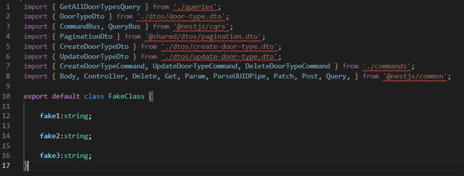

# Import Indentation
Yes, that's what you're thinking... This extension only serves to indent the "imports" of your file. In my daily life, when I have time, I tend to align my imports and I decided to create an extension just for that. I believe it will be useless for 99.9% of the community, but that's okay.

## Feature
The only "feature", as said before, is to "indent the imports", the image below represents well what will be (or should be) done here:



## Automatically Indent

I believe you use a lot of "shift + alt + f" to indent your code daily, so for ease of use you can also add "indent-import" to your shortcuts, just copy and paste the snippet below:

```json
{
    "key": "shift+alt+d",
    "command": "extension.indent-imports",
    "when": "editorTextFocus"
}
```

## Release Notes

### 1.0.0
Initial version of "Indent Imports"